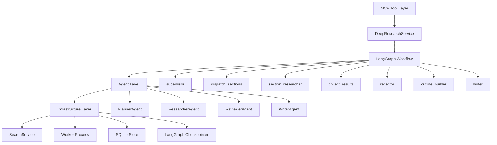
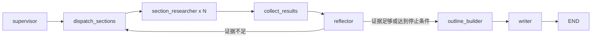

# Deep Research Engine 项目完整技术文档

> 文档版本：v3.0  
> 适用范围：当前重构后的 Deep Research MCP Runtime  
> 文档目标：用通俗语言完整解释项目为什么这样设计、每一层做什么、数据怎么流动、面试时哪些点容易被追问。

---

## 1. 项目一句话

Deep Research Engine 是一个面向开放域复杂问题的自主深度研究系统。它通过 MCP 协议暴露工具接口，让 AI 助手可以像调用普通工具一样调用它；系统内部会先生成调研执行策略，经过用户确认后，再自动完成搜索、证据抽取、质量审查、补查、大纲生成和结构化报告写作。

它不是“搜索一下然后总结”，也不是“让大模型直接写报告”。它更像一个自动化研究流水线：先搞清楚要怎么查，再按任务收集证据，然后判断证据够不够，最后按证据组织报告。

最新简历描述可以对应到下面这条主链路：

```text
用户问题
  -> draft_research_plan
  -> seed queries
  -> 轻量侦察搜索
  -> ResearchExecutionPlan
  -> Human approval
  -> LangGraph execution
  -> SearchService 双层检索
  -> Document
  -> KnowledgeCard
  -> SectionDigest
  -> Evidence Outline
  -> Writer 分章节报告
  -> 可点击引用与 References
```

---

## 2. 核心价值

### 2.1 解决复杂问题不能靠一次搜索

用户问的问题如果很复杂，比如“调研 AI 在无线物理层密钥生成里的研究进展”，普通搜索引擎只会返回很多链接。用户还要自己判断哪些是论文、哪些是综述、哪些是低质量网页、哪些信息是重复的。这个项目把这些人工步骤工程化：

- 自动生成搜索策略；
- 自动选择普通搜索或专业垂直搜索；
- 自动抓取和清洗网页；
- 自动把网页内容抽成结构化证据；
- 自动判断证据是否足够；
- 自动补查缺口；
- 自动写出带来源的 Markdown 报告。

### 2.2 先确认调研执行策略，而不是搜索前拍脑袋写大纲

系统的 draft 阶段不会直接让 LLM 生成报告章节。原因很简单：在还没有搜索之前，系统并不知道真实资料版图。直接生成报告大纲，很容易依赖模型先验，最后和真实资料不匹配。

现在 draft 阶段做的是：

```text
用户问题
  -> 生成 seed queries
  -> 轻量侦察搜索
  -> 总结初步来源版图
  -> 生成 ResearchExecutionPlan
  -> 等待用户确认
```

用户确认的是“怎么查、查哪些来源、怎么筛选、抽取什么字段”，不是最终报告章节。

### 2.3 大纲由证据驱动

正式研究执行之后，系统会把搜索结果变成 KnowledgeCard，再压缩成 SectionDigest。大纲生成阶段只看 SectionDigest，不看海量原始卡片。这样既避免上下文爆炸，又让大纲建立在真实证据上。

---

## 3. 对外 MCP 工具

MCP 是 Model Context Protocol，可以理解成 AI 助手调用外部工具的一套标准。这个项目对外暴露的是 MCP 工具，用户可以在支持 MCP 的 AI 助手里直接调用。

当前工具生命周期如下：

| 工具 | 作用 | 用户什么时候用 |
| --- | --- | --- |
| `check_research_runtime` | 检查运行时、Worker、模型、搜索配置是否正常 | 开始前或排错时 |
| `draft_research_plan` | 生成调研执行策略草稿 | 用户提出研究问题后 |
| `start_research_task` | 用户确认后启动正式研究 | 看完策略并批准后 |
| `get_research_status` | 查看任务进度 | 长任务执行过程中 |
| `get_research_result` | 获取报告路径、预览、质量结果 | 任务完成后 |
| `follow_up_research` | 在已有报告基础上继续追问 | 用户想补充研究 |
| `compare_report_versions` | 比较报告版本差异 | 多轮追问后 |

完整交互不是“一次调用直接写完”，而是 Human-in-the-loop：

```text
draft_research_plan
  -> 用户看调研策略
  -> start_research_task
  -> get_research_status
  -> get_research_result
```

这样做的好处是：如果系统一开始理解错方向，用户可以在正式消耗搜索和写作成本前纠正。

---

## 4. 总体架构

可以把系统分成五层：



### 4.1 四个核心角色和真实图节点的关系

简历里可以说系统以 Supervisor / Researcher / Reflector / Writer 为核心角色。代码里为了并行和收束，又拆了几个辅助节点：

| 真实节点 | 可以理解成 | 主要职责 |
| --- | --- | --- |
| `supervisor` | Supervisor | 读取执行策略，生成可执行搜索任务 |
| `dispatch_sections` | Researcher 的分发器 | 按研究任务 fan-out |
| `section_researcher` | Researcher | 执行搜索、Worker 召回、LLM 抽卡 |
| `collect_results` | Researcher 的汇总器 | 汇总并全局去重 KnowledgeCard |
| `reflector` | Reflector / Reviewer | 判断证据是否足够，生成补查 |
| `outline_builder` | Writer 前的大纲整理模块 | 根据 SectionDigest 生成报告大纲 |
| `writer` | Writer | 按大纲和证据分章节写报告 |

所以，“四个核心角色”是业务视角；真实 LangGraph 节点是工程实现视角。这两个说法并不矛盾。

---

## 5. Draft、ExecutionPlan 与审批

### 5.1 Draft 阶段做什么

`draft_research_plan(topic, background_intent)` 的输出不是报告大纲，而是调研执行策略。

主要步骤：

1. Planner 根据用户问题生成 `seed_queries`。
2. SearchService 做少量侦察搜索。
3. Planner 总结初步来源版图。
4. Planner 生成 `ResearchExecutionPlan`。
5. 工具返回给用户确认。

`ResearchExecutionPlan` 主要包含：

| 字段 | 含义 |
| --- | --- |
| `task_type` | 任务类型，比如 broad exploration / academic research |
| `user_goal` | 系统理解的用户目标 |
| `scope` | 调研范围 |
| `source_strategy` | 来源策略，例如普通网页、学术论文、官方资料 |
| `query_strategy` | 可执行搜索任务列表 |
| `screening_rules` | 结果筛选标准 |
| `extraction_schema` | 后续抽取哪些字段 |
| `quality_rules` | 判断证据质量的规则 |
| `expected_deliverable` | 最终交付物形式 |
| `reconnaissance_summary` | 侦察搜索得到的初步资料版图 |

### 5.2 为什么需要用户审批

研究任务通常会消耗搜索 API、LLM 调用和本地 Worker 资源。用户审批可以避免系统在错误方向上跑很久。

用户确认的是：

- 研究目标理解是否正确；
- 搜索路径是否合理；
- 是否需要 academic 等垂直检索；
- 筛选标准是否符合需求；
- 抽取字段是否覆盖用户要的信息。

---

## 6. LangGraph 工作流

正式执行的主流程如下：



### 6.1 Map-Reduce 是按研究任务并行

这里的 Map-Reduce 不是搜索前预设报告章节的并行，而是按 `ResearchExecutionPlan.query_strategy` 生成的研究任务并行。

- Map：`dispatch_sections` 把 pending 的 SubTask 按 `section_id` 分组，使用 LangGraph `Send()` 并行派发。
- Reduce：每个 `section_researcher` 返回 KnowledgeCard 和任务状态，`collect_results` 汇总并去重。

节点名里还保留了 `section`，但现在更准确地理解为 research track / evidence track。

### 6.2 State 和 Reducer

`ResearchState` 是所有节点共享的数据载体。重要字段包括：

| 字段 | 作用 |
| --- | --- |
| `execution_plan` | 用户确认后的调研执行策略 |
| `sub_tasks` | 当前待执行或已完成的搜索任务 |
| `knowledge_cards` | 累积的结构化证据卡片 |
| `section_digests` | Reflector 生成的章节证据包 |
| `evidence_outline` | OutlineBuilder 生成的大纲 |
| `quality_review` | 质量评审结果 |
| `route_to` | 下一步路由目标 |
| `loop_count` | 补查轮数 |
| `saturation_score` | 跨轮次饱和度 |

并行节点会同时写入部分字段，所以需要 reducer：

- `knowledge_cards` 用追加合并；
- `section_results` 用追加合并；
- `sub_tasks` 用自定义 `_merge_sub_tasks`，按 `(intent, query)` 合并任务状态，避免同一个任务出现 pending 和 completed 两个版本。

---

## 7. SearchService 双层检索

最新检索架构不是把所有搜索源平铺在一个列表里，而是分成两层：

```text
SearchService
  -> GeneralSearchLayer
       Tavily / Exa / Serper / Bocha / DuckDuckGo fallback / optional engines
  -> VerticalSearchLayer
       academic / future domain plugins
  -> Scraper / Extractor
  -> DocumentNormalizer
  -> Ranker
```

### 7.1 普通搜索层

普通搜索层负责广覆盖，适合找：

- 官方文档；
- 新闻和公告；
- 技术博客；
- 产品页面；
- 标准说明；
- 普通网页资料。

当前可用或预留的普通搜索源包括 Tavily、Exa、Serper、Bocha、DuckDuckGo fallback，以及可选的 SerpAPI、Bing、Google、Searx。

新增源默认关闭；没有 key 或开关未启用时跳过。

### 7.2 垂直专业层

垂直层只在任务需要时触发。例如用户要求论文、期刊、会议、医学、专利、法规等，才进入专业检索。

当前 academic vertical 以 Semantic Scholar 雏形为主，arXiv、PubMed Central 等作为接口和配置位预留。

重点是：academic 不是和 Tavily、Serper 平铺的普通 retriever，而是专业领域增强层。

### 7.3 Document 协议

不同搜索 API 返回字段差异很大。有的叫 `content`，有的叫 `raw_content`，有的只有 `snippet`。为避免下游接线混乱，所有结果统一归一成 `Document`：

```python
Document = {
    "document_id": str,
    "url": str,
    "title": str,
    "content": str,
    "raw_content": str,
    "source_name": str,
    "source_layer": "general|vertical",
    "source_kind": "web|paper|pdf|repo|news|mcp|custom",
    "published_time": str,
    "authors": list[str],
    "venue": str,
    "year": int | None,
    "doi": str,
    "pdf_url": str,
    "metadata": dict,
    "score": float,
}
```

后续 Worker、抽卡和 Writer 不直接依赖各搜索 API 的原始字段，只消费这个统一结构。

---

## 8. Researcher 与 Worker

Researcher 的职责是把 SubTask 变成 KnowledgeCard。

流程如下：

```text
SubTask
  -> rewritten_queries
  -> SearchService.search()
  -> Document
  -> 去重和排序
  -> Worker embedding / FAISS / CrossEncoder
  -> evidence records
  -> LLM 抽取 KnowledgeCard
```

### 8.1 三层容错

检索失败不应该直接让整个任务失败，所以链路有三层容错：

1. Retry / backoff：搜索失败先重试。
2. Query reformulation：没有结果或质量差时，改写 query 再搜。
3. Degraded：仍然失败就标记为 degraded，交给 Reflector 判断影响。

如果 degraded 的任务是关键任务，Reflector 会继续生成补查；如果影响低，系统可以继续写作，并在报告里体现不确定性。

### 8.2 Worker 为什么独立进程

embedding、FAISS 召回和 CrossEncoder rerank 都比较重。如果放在主进程里，会阻塞 MCP Server 的事件循环。独立 Worker 进程的好处是：

- 主进程继续响应状态查询；
- 模型加载只在 Worker 里发生；
- embedding 和 rerank 的耗时不影响工具接口；
- Worker 异常可以被 Runtime 管理和重启。

Worker 使用 Small-to-Big 思路：

```text
父块切分
  -> 子句切分
  -> 子句 embedding
  -> FAISS 召回
  -> 从子句恢复父块
  -> CrossEncoder 精排
  -> evidence records
```

这样既能提高召回精度，又能给 LLM 足够上下文。

---

## 9. 证据中间层

### 9.1 KnowledgeCard

KnowledgeCard 是单条证据卡片。它把网页或论文里的信息抽成结构化字段：

| 字段 | 作用 |
| --- | --- |
| `claim` | 这条证据支持的核心判断 |
| `evidence_summary` | 证据摘要 |
| `exact_excerpt` | 原文摘录 |
| `source` | 来源 URL |
| `source_title` | 来源标题 |
| `source_type` | 来源类型 |
| `claim_type` | 断言类型 |
| `confidence` | 置信度 |
| `evidence_score` | 证据分数 |

系统不直接把搜索结果交给 Writer，因为搜索结果太杂。KnowledgeCard 是从“网页内容”到“可控证据”的中间层。

### 9.2 全局去重

多个研究任务可能搜到同一网页、同一观点。`collect_results` 会做全局去重，避免后续报告重复引用同一条信息。

去重的目标不是让信息变少，而是让信息更干净：

- 同一 URL 的重复内容只保留一次；
- 高度相似的 claim 避免重复进入证据包；
- 不同来源支持同一观点时保留来源多样性。

### 9.3 SectionDigest

KnowledgeCard 可能很多，不能稳定全量塞进 LLM 上下文。SectionDigest 是按 research track 压缩出来的章节证据包。

它的作用是“广度粗览”：

- 包含多个 key claims；
- 保留若干 evidence items；
- 带 coverage、evidence count、source diversity 等评分；
- 记录缺口和不确定性；
- 给大纲生成提供材料。

SectionDigest 使用比 Writer 更大的卡片预算，默认由 `DEEP_RESEARCH_SECTION_DIGEST_MAX_CARDS_PER_SECTION` 控制。它不是最终报告，而是给 OutlineBuilder 和 Writer 的中间证据包。

---

## 10. OutlineBuilder 与大纲

OutlineBuilder 的输入不是全量 KnowledgeCard，而是 SectionDigest。

```text
SectionDigest 列表
  -> OutlineBuilder
  -> evidence_outline
  -> plan_data.sections
```

大纲的每个 section 不是简单的标题，还包含取材约束：

| 字段 | 含义 |
| --- | --- |
| `section_id` | 最终报告章节 ID |
| `title` | 章节标题 |
| `purpose` | 这一节的写作目标 |
| `questions` | 这一节要回答的问题 |
| `evidence_digest_ids` | 这一节绑定哪些 SectionDigest |
| `evidence_requirements` | Writer 选择原始卡片时优先满足什么证据要求 |

### 10.1 evidence_digest_ids

`evidence_digest_ids` 告诉 Writer：这一节可以从哪些证据包取材。

例如：

```json
{
  "section_id": "S02",
  "title": "AI 方法解决了哪些 PLKG 痛点",
  "evidence_digest_ids": ["Q01", "Q03"]
}
```

这表示 S02 这一节主要使用 Q01 和 Q03 两个研究任务压缩出的证据包。

### 10.2 evidence_requirements

`evidence_requirements` 不指定具体卡片 ID，也不指定具体链接。它描述“这一节写作时需要什么类型的证据”。

例子：

```json
{
  "evidence_requirements": [
    "优先使用带性能指标的实验结果",
    "需要覆盖主要局限性和不确定性",
    "至少保留一条高置信度原文摘录"
  ]
}
```

这样设计的原因是：大纲阶段负责结构和取材方向，Writer 阶段负责具体挑选卡片。过早指定具体卡片会让 Writer 被锁死，反而不灵活。

---

## 11. Writer 写作与引用

Writer 的输入不是“所有卡片”，也不是“只有摘要”。它每节拿三类信息：

```text
section_plan
  -> title / purpose / questions
  -> evidence_digest_ids
  -> evidence_requirements

SectionDigest
  -> key_claims / evidence items / coverage scores / missing questions

Selected raw KnowledgeCard
  -> claim / evidence_summary / exact_excerpt / source / source_title / confidence
```

### 11.1 为什么还要少量原始 KnowledgeCard

SectionDigest 负责广度和结构，但它毕竟是压缩结果。写作时需要精确表述、原文摘录和引用细节，所以 Writer 会为每节额外筛选少量高相关原始 KnowledgeCard。

筛选时会考虑：

- 是否属于该节绑定的 `evidence_digest_ids`；
- `evidence_score` 高低；
- `confidence` 高低；
- 是否有 `exact_excerpt`；
- 是否符合 `evidence_requirements`；
- 是否有可追溯 URL。

例如，如果 `evidence_requirements` 里写了“优先使用 benchmark metrics”，含 benchmark、metrics、实验指标的卡片会更容易进入写作上下文。

### 11.2 分章节写作

Writer 按大纲逐节写。每一节单独构造 prompt，只放这一节需要的 SectionDigest 和少量原始卡片。这样避免全量上下文爆炸，也让每节写作目标更清楚。

### 11.3 引用输出

正文保留可点击 [1] 小标，也就是视觉上仍然是 `[1]`，但小标本身能跳转到来源：

```html
<sup><a href="https://example.com/paper">[1]</a></sup>
```

References 里保留完整标题：

```md
1. [论文标题](https://example.com/paper)
```

引用校验会做几件事：

- 编号必须能解析到 source catalog；
- URL 必须来自 source catalog；
- 无法解析的编号会被移除；
- 不在 catalog 里的外部链接会被去链接化；
- References 按 URL 去重。

这里的“可追溯”指用户可以点击来源链接回到网页、论文页或 PDF。它不是形式化证明每句话都被原文严格蕴含。

---

## 12. Reflector、补查和饱和度

Reflector 的职责是判断“现在证据够不够”。

它不会只看卡片数量，还会看：

- 覆盖度；
- 证据数量；
- 来源多样性；
- 一手来源比例；
- claim 类型；
- LLM 对语义覆盖的判断；
- 是否有重要冲突或缺口；
- degraded 任务是否影响主结论。

如果证据不足，它会生成 follow-up SubTask，路由回 Researcher。  
如果证据足够，或继续搜索的边际收益很低，就进入大纲生成。

跨轮次饱和度用于避免无限补查。它衡量新一轮搜索带来了多少新覆盖和新卡片。如果新增信息很少，就说明继续搜的价值不大。

---

## 13. 存储、恢复和增量追问

系统有两类 SQLite：

| 存储 | 作用 |
| --- | --- |
| TaskRegistryStore | 保存任务状态、草稿、元数据、事件、报告版本 |
| LangGraph Checkpointer | 保存图执行状态，用于长任务恢复 |

本地文件产物包括：

- Markdown 报告；
- KnowledgeCard JSON；
- Source catalog JSON；
- Activity 日志；
- Metadata；
- per-task log；
- trace file。

增量追问依赖 checkpoint 恢复已有状态。`follow_up_research` 会读取已有 cards 和 plan，再生成新的子任务，最后保存新版本报告。`compare_report_versions` 可以对比不同版本的变化。

---

## 14. LiteLLM 多模型适配

系统通过 LiteLLM 调用模型，不直接绑定某一家供应商。配置里支持：

- 默认模型；
- planner model；
- researcher model；
- writer model；
- reviewer model。

这样可以按角色选模型。例如：

- Planner 需要规划能力；
- Researcher 需要稳定抽取 JSON；
- Reviewer 需要判断覆盖度和缺口；
- Writer 需要长文本写作能力。

角色分模型可以在成本和质量之间做平衡。

---

## 15. 测试覆盖

当前重构专项测试覆盖了关键行为：

- draft 返回调研执行策略，不返回报告章节；
- SearchService 双层检索和 academic vertical 触发；
- optional search source 的配置开关；
- Document normalizer 的稳定字段；
- Graph 顺序：reflector -> outline_builder -> writer；
- fake LangGraph smoke test；
- OutlineBuilder 使用 SectionDigest，不使用全量 KnowledgeCard；
- `evidence_digest_ids` 和 `evidence_requirements` 保留；
- SectionDigest 的卡片预算大于 Writer raw cards；
- evidence requirements 参与 raw card selection；
- 正文引用输出为可点击 `[1]` 小标；
- References 输出完整来源链接；
- 无效编号和非 catalog 链接被清理。

---

## 16. 面试时最容易讲错的点

| 不要这样说 | 更准确说法 |
| --- | --- |
| 系统先生成报告大纲再搜索 | 系统先生成调研执行策略，证据收集后再生成大纲 |
| 所有搜索源都平铺成 retriever | 普通搜索层和垂直专业层分开，academic 是 vertical plugin |
| Map-Reduce 是搜索前章节级并行 | Map-Reduce 是按研究任务 / research track 并行 |
| Writer 只看 SectionDigest | Writer 看大纲、SectionDigest 和少量高相关原始 KnowledgeCard |
| 大纲指定具体卡片 | 大纲绑定 evidence_digest_ids，并给 evidence_requirements |
| 引用绝对证明正确 | 引用来源链接可点击、可回溯、经过 source catalog 校验 |
| 正文显示长标题链接 | 正文显示可点击 `[1]` 小标，References 显示完整标题 |

---

## 17. 总结

这个项目的核心不是“会联网搜索”，而是把复杂研究任务拆成一条可确认、可执行、可审查、可补查、可追溯的流水线。

最重要的设计是：

- 先确认调研执行策略；
- 搜索层分普通层和垂直层；
- 所有搜索结果统一成 Document；
- 证据抽成 KnowledgeCard；
- 大量卡片压缩成 SectionDigest；
- 大纲基于 SectionDigest 生成；
- Writer 按大纲分章节写，并额外使用少量高相关原始卡片；
- 引用以可点击 `[1]` 小标和 References 来源链接呈现。

这套设计的目标是降低幻觉、控制上下文、保留证据细节，并让长时研究任务可以恢复和追问。
